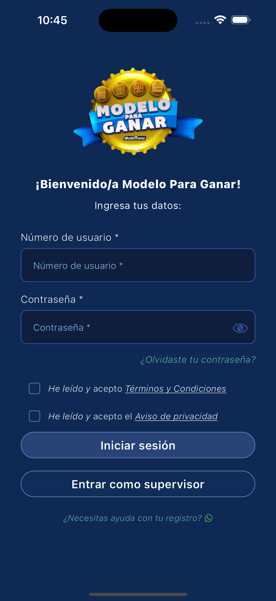
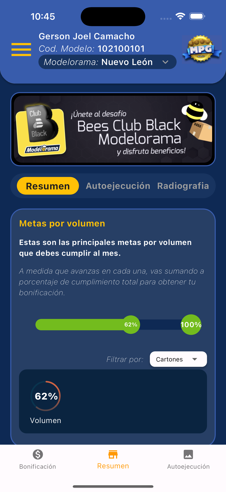

# superlikers

## Correr la app

### descargar aqui
```
https://install.appcenter.ms/users/alejandrorodriguez/apps/superlikers/distribution_groups/testers
```

### Funcionamiento

al iniciar se encuentra la pantalla de login donde se valida si los campos son vacios o si falta algun campo por llenar ademas el boton de 'Iniciar sesión' no se activa si no hasta acepter terminos y condiciones y aviso de privacidad. 

Al iniciar sesión se guarda el estado en loca storage y cuando cierre la app y la vuelva a abrir ya no entra a la pantalla de login si no que redirige directamente a el main.

## Como usarlo
**Paso 1:**

Descargar o clonar este respositorio usando este link:

```
https://github.com/AlejandroRodriguezO/superlikers.git
```

**Paso 2:**

Vaya a la raíz del proyecto y ejecute el siguiente comando en la consola para obtener las dependencias necesarias:

```
flutter clean
```
```
flutter pub get
```
**Paso 3:**

Ejecutar el comando para mantener el código fuente sincronizado automáticamente:

```
flutter pub run build_runner build
```

**Paso 4:**

En caso de ejecutar pruebas puede realizarlo con el comando:

```
flutter test 
```

### Folder Structure
Ésta es la estructura de carpetas que nos proporciona flutter.

```
superlikers/
|- android
|- assets
|- build
|- ios
|- lib
|- test
```

Ésta es la estructura de carpetas que hemos estado usando en este proyecto.

```
lib/
|- core/
|- features/
```

### Anexo imagenes del funcionamiento

  <table>
    <tbody>
    <tr>
        <th><Strong>Login</Strong></th>
        <th><Strong>Main</Strong></th>
      </tr>
        <tr>
            <td> </td>
            <td> </td>
        </tr>
     </tr>   
    </tbody>
  </table>